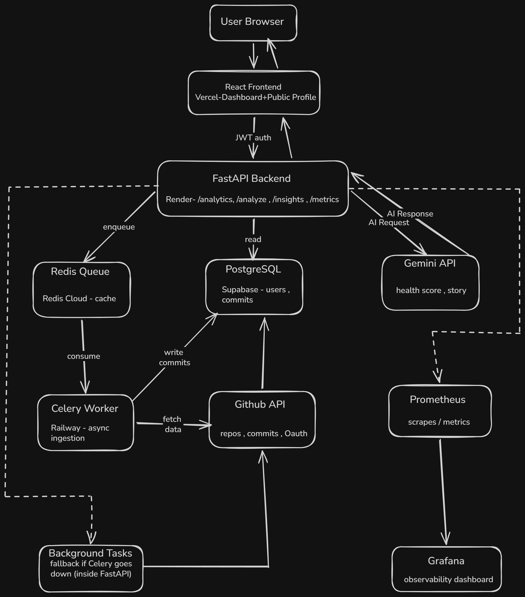
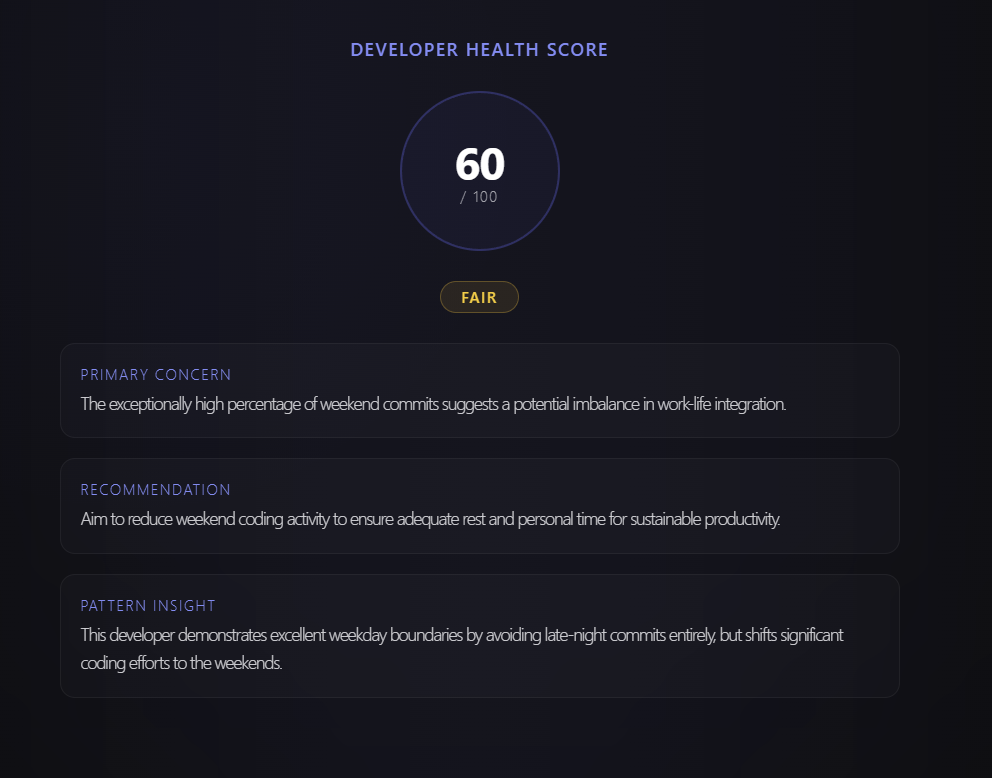
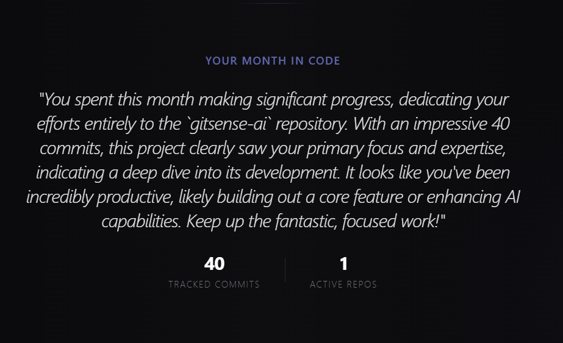
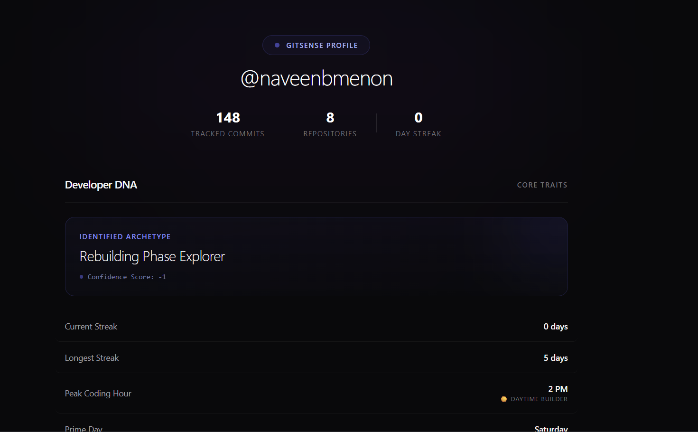

# GitSense AI

> AI-powered distributed developer intelligence platform — transforms raw GitHub activity into behavioral analytics, health scoring, and commit narratives.

[](https://gitsense-ai-dashboard.vercel.app/)
[](https://gitsense-ai-dashboard.vercel.app/u/naveenbmenon)
[](https://gitsense-ai-2.onrender.com/docs)
[](https://github.com/naveenbmenon/gitsense-ai)

[Live Demo](https://gitsense-ai-dashboard.vercel.app/) • [My Public Profile](https://gitsense-ai-dashboard.vercel.app/u/naveenbmenon) • [API Docs](https://gitsense-ai-2.onrender.com/docs) • [Health Check](https://gitsense-ai-2.onrender.com/health)

---
## Landing Page Preview


---
## Dashboard Preview


---

## What is GitSense AI?

GitSense AI is a **production-grade, distributed analytics platform** that ingests a developer's GitHub activity asynchronously and surfaces structured intelligence — commit patterns, behavioral insights, AI-generated health scores, and narrative commit stories.

It is not a static stats viewer. All analytics run server-side across a distributed system spanning 4 cloud services, with event-driven ingestion, Redis caching, Prometheus observability, and Gemini-powered AI features.

---

## System Architecture


```
Browser
  ↕ JWT / REST
React Frontend (Vercel)
  ↕ HTTP
FastAPI Backend (Render)
  ├── → Redis Cloud       (task queue + response cache)
  ├── → PostgreSQL        (Supabase — users, repos, commits)
  ├── → Gemini API        (AI health score + commit story)
  └── ← Prometheus        (scrapes /metrics endpoint)
         └── → Grafana    (observability dashboard)

Redis Cloud
  └── → Celery Worker     (Railway — async ingestion)
         ├── → GitHub API (fetch repos + commits)
         └── → PostgreSQL (write ingested data)

FastAPI (fallback only)
  └── → BackgroundTasks   (runs if Celery is unreachable)
```

---

## Architecture Diagram



---

## Key Features

### Distributed Async Ingestion
GitHub data is never fetched synchronously. Every analyze request enqueues a Celery task via Redis. The worker runs on Railway, fetches from GitHub API, and writes to PostgreSQL — completely decoupled from the API layer.

### Graceful Fallback Execution
If Celery is unreachable, FastAPI automatically falls back to `BackgroundTasks` for ingestion. Users never see an error — the system degrades gracefully.

### Redis Cache-Aside Pattern
Analytics and insights are cached in Redis for 30 minutes after computation. Cache is automatically invalidated by the Celery worker after fresh ingestion completes, ensuring users always see up-to-date data.

### AI Developer Health Score
Gemini 2.5 Flash analyzes commit frequency, late-night coding patterns, weekend activity, and weekly velocity to generate a 0-100 health score with a status label, primary concern, recommendation, and pattern insight.

### AI Commit Story Generator
Gemini 2.5 Flash reads the last 30 days of repository activity and writes a personalized 3-4 sentence narrative of what the developer built — in second person, encouraging tone.


### Statistical Anomaly Detection
Compares current week's commit count against the 4-week moving average. Flags activity drops >40% and spikes >50% with specific percentage deviations.

### Developer Personality Classification
Scores developers across 4 dimensions (consistency, momentum, depth, behavior) and assigns one of 5 personality archetypes — from "Elite Consistency Architect" to "Rebuilding Phase Explorer."

### Prometheus Observability
Every API endpoint is instrumented via `prometheus-fastapi-instrumentator`. A `/metrics` endpoint exposes request counts, latency histograms, and error rates — visualized in Grafana.

### Per-User Rate Limiting
Redis pipeline enforces a maximum of 5 ingestion requests per user per hour. Uses atomic pipeline commands (INCR + EXPIRE in one round trip) to minimize Redis command overhead.

### Public Profile Pages
Every user gets a shareable public profile at `/u/{username}` — showing stats, coding DNA, and AI insights without requiring login. Designed for LinkedIn sharing and recruiter visibility.



---

## Tech Stack

| Layer | Technology | Purpose |
|---|---|---|
| Frontend | React + Vite + Tailwind CSS | Dashboard + public profiles |
| Backend | FastAPI (Python) | API layer, OAuth, analytics |
| Task Queue | Celery + Redis | Async GitHub ingestion |
| Cache | Redis Cloud | Response cache + rate limiting |
| Database | PostgreSQL (Supabase) | Users, repos, commits, languages |
| AI | Gemini 2.5 Flash (Google) | Health score + commit story |
| Monitoring | Prometheus + Grafana | Observability |
| Auth | GitHub OAuth 2.0 + JWT | Secure authentication |
| Deployment | Render + Railway + Vercel | 4-service production deployment |

---

## Deployment Architecture

| Service | Platform | Role |
|---|---|---|
| FastAPI backend | Render | API, OAuth, analytics, ingestion trigger |
| Celery worker | Railway | Async GitHub ingestion worker |
| PostgreSQL | Supabase | Primary database |
| Redis | Redis Cloud | Task queue + cache (no request limits) |
| React frontend | Vercel | Dashboard + public profile pages |

---

## Performance

Load tested using Locust against the deployed backend at peak load.

| Concurrent Users | Avg Latency | Error Rate |
|---|---|---|
| 10 | ~120ms | 0% |
| 25 | ~300ms | 0% |
| 50 | ~580ms | 0% |

Cache-aside pattern reduces p50 latency by ~70% on repeated requests. Redis TTL set to 30 minutes with automatic invalidation after ingestion.

---

## Observability

```
GET /health   → checks DB + Redis connectivity
GET /metrics  → Prometheus metrics (request rate, latency, errors)
```


---

## API Endpoints

### Authentication
```
GET  /auth/login              → initiate GitHub OAuth
GET  /auth/callback           → OAuth callback, returns JWT
GET  /user/me                 → current user info (JWT required)
```

### Core Analytics
```
GET  /analyze/{username}      → trigger async ingestion
GET  /analytics/{username}    → full analytics + anomaly detection
GET  /insights/{username}     → behavioral + AI insights
GET  /summary/{username}      → total commits + language distribution
GET  /heatmap/{username}      → 365-day contribution heatmap
```

### System
```
GET  /health                  → DB + Redis health check
GET  /metrics                 → Prometheus metrics
GET  /docs                    → OpenAPI documentation
```

---

## Analytics Engine

All computation runs server-side in `app/services/analytics.py`:

- **Commit streaks** — longest streak + current streak (IST timezone)
- **Peak coding hour** — most frequent commit hour
- **Favorite day** — most active weekday
- **Monthly trend** — percentage change vs previous month
- **Weekly activity** — this week vs last week delta
- **Top repositories** — most active repos in last 30 days
- **Momentum score** — On Fire / Rising / Stable / Cooling Down
- **Personality classification** — scored across 4 dimensions
- **Anomaly detection** — statistical deviation from 4-week baseline

---

## Insight Engine

`app/analytics/insights.py` generates 5 insight types:

| Type | Source | Description |
|---|---|---|
| `activity` | Rule-based | High weekend activity detection |
| `repository` | Rule-based | Inactive repository detection |
| `skill` | Rule-based | Language concentration analysis |
| `ai_health` | Gemini 2.5 Flash | Developer health score 0-100 |
| `ai_story` | Gemini 2.5 Flash | 30-day commit narrative |

---

## Ingestion Pipeline

```
1. User hits GET /analyze/{username}
   ↓
2. FastAPI checks Redis rate limit (5/hour per user)
   ↓
3. FastAPI checks GitHub API rate limit (>100 remaining)
   ↓
4. FastAPI enqueues run_ingestion.delay() via Redis
   ↓
5. Returns immediately — "Analysis started, mode: distributed"
   ↓
6. Celery worker (Railway) picks up task
   ↓
7. Worker fetches repos + commits from GitHub API
   (incremental — only since last_fetched_at)
   ↓
8. Worker writes to PostgreSQL with retry logic (max 3, exponential backoff)
   ↓
9. Worker invalidates Redis cache for this user
   ↓
10. Next /analytics request recomputes fresh data
```

**Fallback:** If Celery is unreachable, step 4-9 runs via FastAPI BackgroundTasks instead.

---

## Database Schema

```
users
├── id (PK)
├── github_username (UNIQUE)
├── github_token
├── avatar_url
└── last_fetched_at

repositories
├── id (PK)
├── user_id (FK → users.id)
├── repo_name
├── last_pushed_at
└── is_fork

commits
├── id (PK)
├── repo_id (FK → repositories.id)
├── commit_sha (UNIQUE)
├── commit_time
└── commit_message_length

repo_languages
├── id (PK)
├── repo_id (FK → repositories.id)
├── language
└── bytes
```

---

## Running Locally

### Prerequisites
- Python 3.11+
- Node.js 18+
- Redis (local or cloud)
- PostgreSQL (local or Supabase)
- Gemini API key (aistudio.google.com)
- GitHub OAuth app

### Backend

```bash
git clone https://github.com/naveenbmenon/gitsense-ai
cd gitsense-ai

pip install -r requirements.txt

# Create .env
cp .env.example .env
# Fill in: DATABASE_URL, REDIS_URL, GITHUB_CLIENT_ID,
#          GITHUB_CLIENT_SECRET, JWT_SECRET, GEMINI_API_KEY

uvicorn app.main:app --reload
```

API: http://localhost:8000
Docs: http://localhost:8000/docs

### Celery Worker

```bash
python3 -m celery -A app.celery.celery_app worker --loglevel=info --pool=solo
```

### Frontend

```bash
cd frontend
npm install
npm run dev
```

App: http://localhost:5173

### Grafana (local observability)

```bash
docker run -d -p 3001:3000 grafana/grafana
```

Open http://localhost:3001 — add Prometheus data source pointing to your backend `/metrics`.

---

## Engineering Decisions

**Why Redis Cloud over Upstash?**
Upstash free tier has a 500k request/month hard limit. Redis Cloud free tier has no request limit — only a 30MB storage limit. For a caching + queuing workload, request volume is the binding constraint, not storage.

**Why Railway for Celery?**
Railway's usage-based billing means the Celery worker costs near-zero when idle. Celery workers are bursty by nature — they're idle most of the time and spike during ingestion. Railway's model fits this pattern better than fixed-instance platforms.

**Why Render for FastAPI?**
Render's permanent free tier for web services is suitable for a portfolio-stage project with a predictable always-on requirement.

**Why pipeline for rate limiting?**
Two Redis commands (INCR + EXPIRE) batched into one pipeline call halves the network round trips for every analyze request — reducing Redis command overhead by 50%.

**Why 30-minute cache TTL?**
GitHub commit data doesn't change frequently. A 30-minute TTL dramatically reduces cache misses vs the original 5-minute TTL, reducing Redis reads by ~80% without meaningfully staling the data.

---

## Roadmap

### v2.0 (Complete) ✅
- Distributed async ingestion via Redis + Celery
- Graceful fallback to BackgroundTasks
- PostgreSQL migration from SQLite
- Incremental ingestion (since last_fetched_at)
- Exponential backoff retry (max 3)
- Redis cache-aside with automatic invalidation
- IST timezone fix for all date calculations
- Prometheus instrumentation
- Health check endpoint (DB + Redis)
- Per-user rate limiting (Redis pipeline)
- Commit anomaly detection (statistical)
- Developer Health Score (Gemini AI)
- Commit Story Generator (Gemini AI)
- Developer personality classification
- Public profile pages (/u/{username})
- Premium SVG favicon

### v3.0 (Planned)
- Multi-tenancy (any GitHub user can sign up)
- Razorpay payment integration
- Weekly email digest (Resend API)
- GitHub App (webhook-based real-time ingestion)
- Team dashboards and contributor comparison

---

## Author

**Naveen Bijulal Menon**
- GitHub: [@naveenbmenon](https://github.com/naveenbmenon)
- Portfolio: [naveen-dev.vercel.app](https://naveen-dev.vercel.app)
- Email: naveenbijulalmenon@gmail.com
- LinkedIn: [naveen-bijulal-menon](https://linkedin.com/in/naveen-bijulal-menon)

---

*Built with engineering discipline across a distributed system — not template code.*
