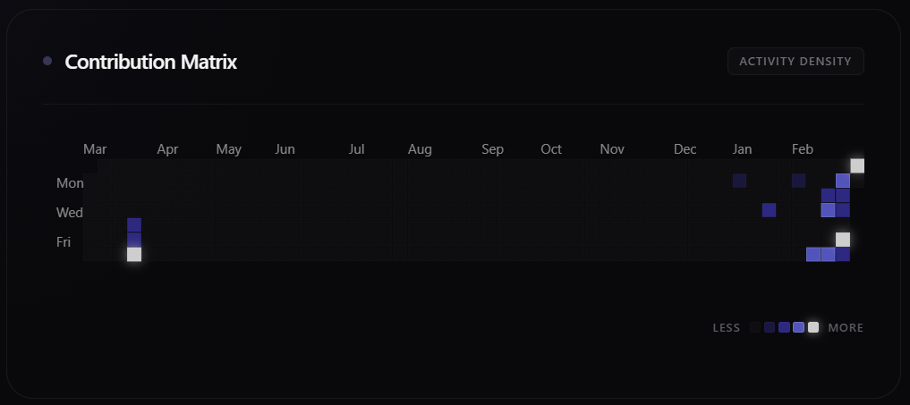

# 🧠 GitSense AI

### AI-Powered GitHub Developer Intelligence Platform

*Transform raw GitHub activity into structured behavioral analytics.*

[](https://gitsense-ai-dashboard.vercel.app/)
[](https://github.com/naveenbmenon/gitsense-ai)


[Live Demo](https://gitsense-ai-dashboard.vercel.app/) • [API Docs](https://gitsense-ai-2.onrender.com) 


---

## 📸 Preview

### Landing Page


### Analytics Dashboard


### Contribution Heatmap


---

## 🎯 What is GitSense?

GitSense AI is a **full-stack SaaS-style platform** that analyzes GitHub developer activity and transforms it into structured, explainable analytics.

It provides:

* 🔐 Secure GitHub OAuth authentication
* 📊 Backend-driven analytics computation
* 📈 Contribution trend visualization
* 🧠 Deterministic behavioral insights
* ⚡ Load-tested deployed infrastructure

GitSense is not a static stats viewer — all analytics logic runs server-side.

---

## 🏗️ System Architecture

```
User → GitHub OAuth → FastAPI Backend (Render) → SQLite Database
                              ↓
                      Analytics Engine
                              ↓
                      Insight Engine
                              ↓
                        JWT-Protected APIs
                              ↓
                  React Dashboard (Vercel)
```

---

## 🛠 Tech Stack

* **Backend:** FastAPI (Python), SQLAlchemy ORM
* **Database:** SQLite (portable to PostgreSQL)
* **Frontend:** React + Vite + Tailwind CSS
* **Auth:** GitHub OAuth 2.0 + JWT
* **Charts:** Chart.js
* **Deployment:** Render (backend) + Vercel (frontend)
* **Load Testing:** Locust

---

## 🔐 Authentication Flow

1. User clicks "Login with GitHub"
2. Redirect to GitHub OAuth
3. GitHub returns authorization code
4. Backend exchanges code for access token
5. Backend generates JWT
6. Frontend stores JWT
7. All protected APIs require `Authorization: Bearer <jwt>`

Rate limiting is enforced on API routes.

---

## 📊 Analytics Engine

Backend computes structured metrics including:

* Commits per day (time series)
* 365-day contribution heatmap data
* Weekend vs weekday activity ratio
* Repository activity breakdown
* Active vs inactive repository detection
* Language distribution percentages
* Contribution consistency signals

All computation runs server-side.

Large responses are handled via **pagination**.

---

## 🧠 Insight Engine

GitSense uses a deterministic, rule-based insight system to generate explainable developer insights:

* Detects unusually high weekend activity
* Flags inactive repositories
* Identifies dominant language concentration
* Highlights contribution frequency patterns

No black-box ML models are used.

---

## 🔄 Data Ingestion Pipeline

```
1. User triggers /analyze/{username}
   ↓
2. Backend checks last_fetched_at
   ↓
3. If stale → fetch fresh data from GitHub
   ↓
4. GitHub API calls (paginated, 100 per page)
   ↓
5. Idempotent insert/update into database
   ↓
6. Update last_fetched_at timestamp
   ↓
7. Return analytics via JWT-protected API
```

### Key Engineering Decisions

* Idempotent ingestion (no duplicate commits)
* Normalized relational schema
* Clear separation of ingestion vs analytics
* Backend-driven logic (no business logic in frontend)

---

## 📈 Performance Metrics

Load tested using **Locust** against deployed backend.

### Observed Results

| Concurrent Users | Avg Latency | Failure Rate |
|------------------|-------------|--------------|
| 10               | ~300ms      | 0%           |
| 25               | ~336ms      | 0%           |
| 50               | 8–10s avg   | 0%           |

### Observations

* System remains stable under concurrency
* No request failures observed
* Latency increases at higher concurrency due to synchronous analytics computation and SQLite contention
* Tail latency observed at higher percentiles under load

These findings inform future optimizations (caching, precomputation, DB migration).

---

## 🗄 Database Schema

```
User
├── id (PK)
├── github_username (UNIQUE)
├── github_token
└── last_fetched_at

Repository
├── id (PK)
├── name
├── user_id (FK → User.id)
├── primary_language
└── language_stats (JSON)

Commit
├── id (PK)
├── commit_time
└── repository_id (FK → Repository.id)
```

### Design Principles

* Normalized relational modeling
* Foreign key relationships
* Query-friendly structure
* Portable to PostgreSQL for horizontal scaling

---

## 🔌 API Endpoints

### Authentication
```
GET  /auth/login              # Initiate GitHub OAuth
GET  /auth/callback           # OAuth callback handler
GET  /user/me                 # Current user info (JWT required)
```

### Analytics
```
GET  /analytics/{username}    # Full analytics (JWT required)
GET  /insights/{username}     # Behavioral insights (JWT required)
GET  /analyze/{username}      # Trigger data refresh (JWT required)
GET  /summary/{username}      # Summary stats (JWT required)
```

### System
```
GET  /health                  # Health check
GET  /docs                    # OpenAPI documentation
```

All analytics endpoints require JWT authentication.

---

## 🚀 Roadmap

### Phase 1 (Complete) ✅
* OAuth 2.0 authentication
* Idempotent ingestion pipeline
* Backend analytics engine
* 365-day heatmap
* Load testing validation
* Rate limiting
* Pagination
* Production deployment

### Phase 2 (Planned) 📋
* Redis caching layer
* Precomputed analytics storage
* Public shareable profiles (`/u/{username}`)
* Developer Momentum Score
* PostgreSQL migration

### Phase 3 (Future) 🔮
* Background job processing
* Advanced developer scoring metrics
* Organization-level dashboards
* Performance optimization layer

---

## 🧪 Running Locally

### Backend

```bash
cd backend
pip install -r requirements.txt
uvicorn app.main:app --reload
```

**API:** http://localhost:8000  
**Docs:** http://localhost:8000/docs

### Frontend

```bash
cd frontend
npm install
npm run dev
```

**App:** http://localhost:5173

---


## 👤 Author

**Naveen Bijulal Menon**

* GitHub: [@naveenbmenon](https://github.com/naveenbmenon)
* Email: naveenbijulalmenon@gmail.com
* LinkedIn: [Your LinkedIn](https://linkedin.com/in/naveen-bijulal-menon)

---

## ⭐ Why This Project Stands Out

* Full OAuth 2.0 implementation
* JWT-secured backend APIs
* Normalized relational schema
* Rate-limited production endpoints
* Load-tested deployment
* Backend-driven analytics architecture
* Idempotent data ingestion

**Built with engineering discipline — not template code.**

---


### ⭐ Star this repo if you find it helpful!

**Built with ❤️ for developers**
